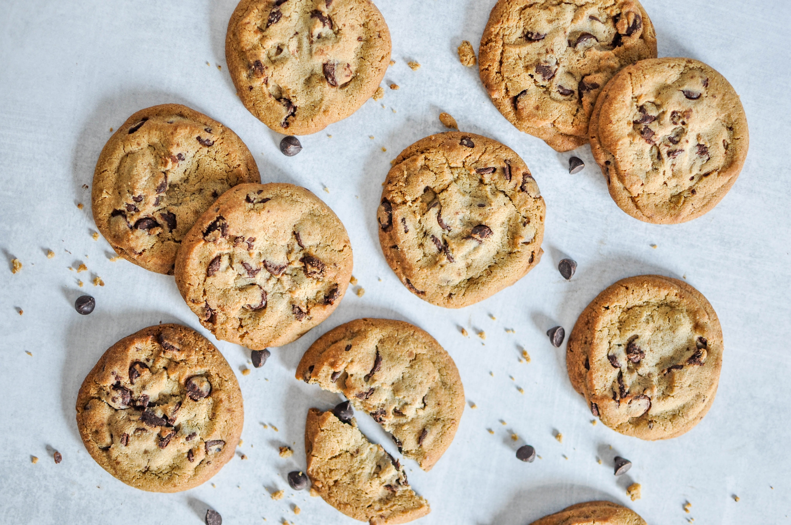
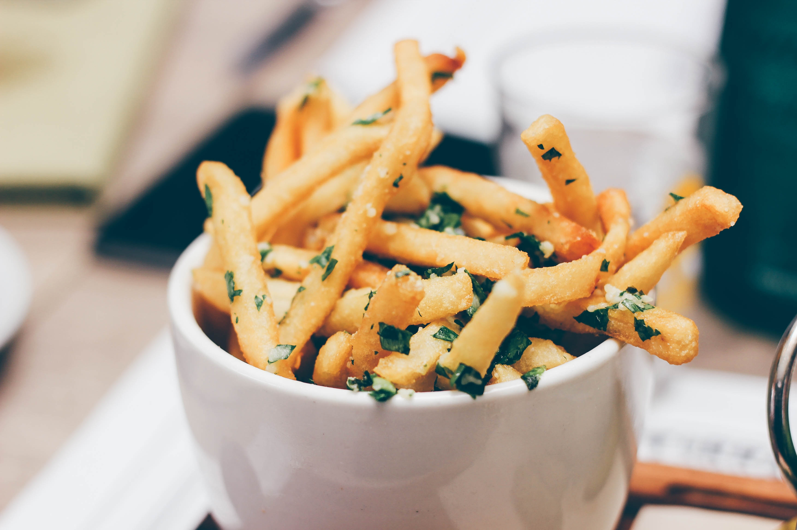

<!doctype html>
<html lang="PT-br">
  <head>
    <!-- Required meta tags -->
    <meta charset="utf-8">
    <meta name="viewport" content="width=device-width, initial-scale=1, shrink-to-fit=no">

    <!-- Bootstrap CSS -->
    <link rel="stylesheet" href="https://stackpath.bootstrapcdn.com/bootstrap/4.3.1/css/bootstrap.min.css" integrity="sha384-ggOyR0iXCbMQv3Xipma34MD+dH/1fQ784/j6cY/iJTQUOhcWr7x9JvoRxT2MZw1T" crossorigin="anonymous">
    <link rel="stylesheet" href="https://use.fontawesome.com/releases/v5.8.2/css/all.css" integrity="sha384-oS3vJWv+0UjzBfQzYUhtDYW+Pj2yciDJxpsK1OYPAYjqT085Qq/1cq5FLXAZQ7Ay" crossorigin="anonymous">

    

    <title>Laura Silva - Food Photographer</title>
  </head>
  <body>

<nav class="navbar navbar-expand-lg navbar-inverse navbar-dark bg-dark fixed-top">
  <a class="navbar-brand" href="#"> <i class="far fa-image"></i>IMGS</a>
  <button class="navbar-toggler" type="button" data-toggle="collapse" data-target="#navbarNav" aria-controls="navbarNav" aria-expanded="false" aria-label="Toggle navigation">
    
  </button>
  

    <ul class="nav navbar-nav">
      <li class="nav-item">
        <a class="nav-link" href="#">Sobre</a>
      </li>
      <li class="nav-item">
        <a class="nav-link" href="#">Contato</a>
      </li>
      <li class="nav-item">
        <a class="nav-link" href="#">Login</a>
      </li>
        <li class="nav-item">
        <a class="nav-link" href="#">Sign Up</a>
      </li>
      </ul>
  

</nav>

 

 	 	 <h1> <i class="fas fa-camera-retro"></i>
 	 Laura Silva</h1>
 	 
Food Photographer

 

   

		

			
		
 
	

	

		

			
		
 
	

	

		

			
		
 
	

	

		

			
		
 
	

	

		

			
		
 
	

	

		

			
		
 
	

	

	

	<footer>
		

			
Layout por Roberta Figliolino | Imagens por Unsplashed

		

	</footer>

    <!-- Optional JavaScript -->
    <!-- jQuery first, then Popper.js, then Bootstrap JS -->
    
    
    
  </body>
</html>
